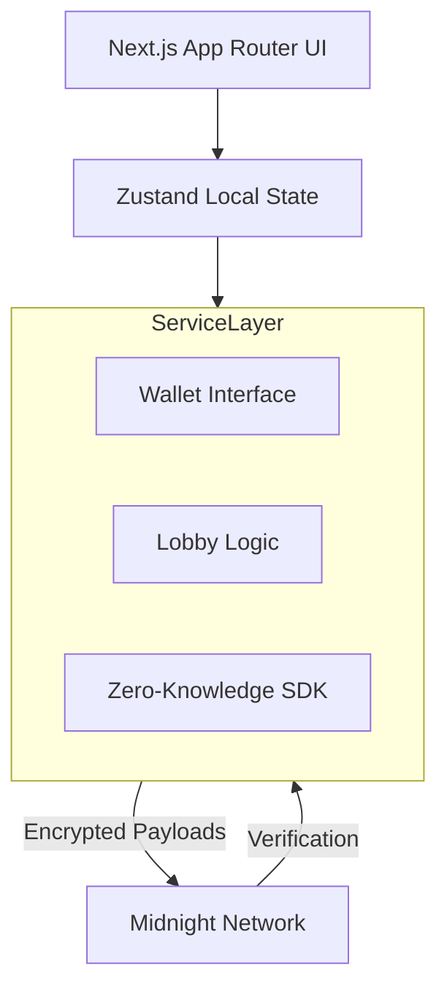

# Phantom Heist


**Plan Secretly. Execute Simultaneously. Win Cryptographically.**

Phantom Heist is a multiplayer stealth strategy game powered by the Midnight Blockchain. It proves that competitive PvP games can exist entirely on-chain without sacrificing hidden information, speed, or gameplay depth.

---

## 🏆 Hackathon Project

This project was built for the Midnight Blockchain Hackathon to demonstrate the incredible potential of Data Protection and Zero-Knowledge proofs in gaming.

### Business Value
The Web3 gaming industry is currently bottlenecked by the "transparent ledger" problem. Because all blockchain data is public by default, games relying on hidden information (Fog of War, Secret Strategies, Hidden Roles) cannot be built on standard chains without centralizing the game logic on a private server.

Phantom Heist solves this. By leveraging Midnight, we unlock an entirely new genre of trustless, decentralized games. This SDK integration opens the door for developers to build Poker, Strategy, and Social Deduction games fully on-chain.

### Judging Criteria Mapping
- **Innovation**: First-of-its-kind cryptographic PvP stealth strategy game.
- **Technical Complexity**: Seamlessly orchestrates Zero-Knowledge commitments, automated orchestration timers, and Procedural Web Audio synthesis without dropping frames.
- **User Experience (UX)**: Features a AAA-quality, Framer Motion-powered interface with micro-interactions, responsive design, and dynamic loading states.

---

## ⚠️ The Problem: Public Ledger Gaming

In traditional Web3 multiplayer games:
1. **Front-running**: If Player A commits a strategy to the chain, Player B can view the mempool, see Player A's move, and counter it perfectly.
2. **State Leakage**: You cannot build a "stealth" game if everyone can read your coordinates on an block explorer.

## 🛡️ The Solution: Midnight Blockchain

Phantom Heist uses Midnight's core capabilities:
- **Zero-Knowledge Commitments**: Players select their loadouts and infiltration paths in the **Planning Room**. This data is encrypted locally and submitted to the chain as a cryptographic proof.
- **Simultaneous Resolution**: Only when both players have submitted their ZK-proofs does the smart contract verify the rules and resolve the outcome. 
- **Privacy Dashboard**: We built a dedicated dashboard (`/privacy`) to explicitly visualize the difference between the transparent public ledger (Game ID, Timestamps) and the encrypted Midnight state (Pathways, Equipment).

---

## 🏗️ Architecture Diagram



## 🛠️ Technology Stack

- **Framework**: Next.js 15 (App Router)
- **Styling**: Tailwind CSS v4
- **Animations**: Framer Motion
- **State Management**: Zustand
- **Audio Engine**: Native Web Audio API (Procedural Synthesis)
- **Icons & UI**: Lucide React, Sonner (Toasts), Canvas Confetti

## 📁 Folder Structure

```
phantom-heist/
├── src/
│   ├── app/                # Next.js App Router (Pages & Layouts)
│   ├── components/         # Reusable UI Components (Cards, Buttons, Cursors)
│   ├── providers/          # Global Contexts (AudioProvider)
│   ├── services/           # Midnight Blockchain Integration Layer
│   └── store/              # Zustand State Management
├── public/                 # Static Assets
└── package.json            # Dependencies
```

## 🚀 Setup Instructions

1. **Clone the repository**
2. **Install dependencies**:
   ```bash
   npm install
   ```
3. **Start the development server**:
   ```bash
   npm run dev
   ```
4. **View the application**: Open `http://localhost:3000` in your browser.

> **Note**: For Hackathon Judges, we have included a **Launch Demo Mode** button on the homepage. Clicking this will run an automated, 60-second end-to-end demonstration of the game flow, simulated networking, cinematic replay, and the Privacy Dashboard.

## 🔮 Future Roadmap

- **Mainnet SDK Integration**: Swap out the `src/services/mock` classes with the live Midnight smart contracts.
- **Expanded Arsenal**: Introduce more Operatives (e.g., Demolitions, Sniper) and map layouts.
- **Tokenomics**: Implement an economy where players stake tokens on their heist outcomes, protected by Midnight's shielded pools.
